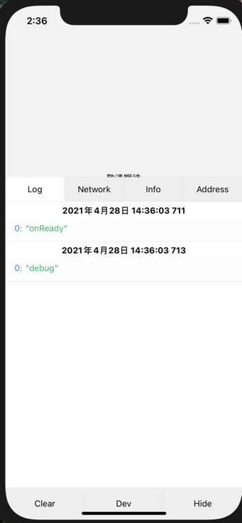
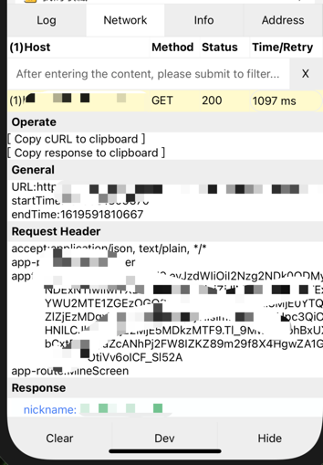
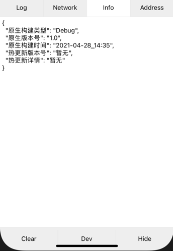
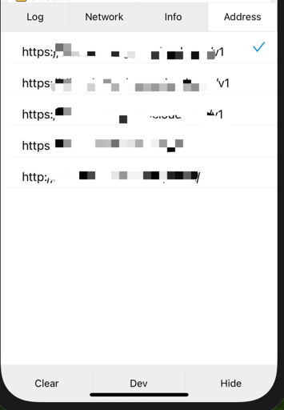

# @grewer/react-native-vconsole


本插件集合了多种 vconsole 的优点:
https://github.com/itenl/react-native-vdebug#readme
https://github.com/sigmayun/react-native-vconsole

vConsole for react native, inspired by vconsole & vconsole-react-native &rnvconsole. Debugger on top of screen. Have a try in expo https://snack.expo.io/SklJHMS3S

## Features

1. console[log, warn, error, info] in Log Panel.
2. Network request list & detail.
3. Customized Version Info you want to show.

## Install

```shell
$ yarn add @grewer/react-native-vconsole
// or
npm i @grewer/react-native-vconsole
```

## Usage


可接受参数
```
interface PropsType {
  appInfo?: {}
  console?: boolean
  panels?: {
    title: string
    component: React.ReactNode
  }
}
```

```javascript
import VConsole from '@grewer/react-native-vconsole'
/* INFO is optional */

// in render function
render() {
  return (
    <View>
        <VConsole
            // 使用 'react-native-config-reader' 库获获取额外信息
            appInfo={{
                原生构建类型: ConfigReader.BUILD_TYPE,
                原生版本号: ConfigReader.VERSION_NAME || ConfigReader.CFBundleShortVersionString,
                原生构建时间: ConfigReader.BUILD_TIME,
                热更新版本号: codePushStore.info.label,
                热更新详情: codePushStore.info.desc,
            }}
            // 另外的的面板
            panels={panels}
            // console.time 可辨别是否开启 debug 网页
            console={!console.time}
        />
    </View>
  )
}
```

## Examples

### Log Panel

<div align=center></div>

### Network Panel

<div align=center></div>

### Info Panel

<div align=center></div>

### extra Panel

可以用来显示任意东西, 此处我使用它来实现一个切换 请求路径的功能

<div align=center></div>
